# Runtime architecture

```mermaid
flowchart LR
    curator["Curator"] --> browser
    visitor["Visitor"] --> browser

    subgraph browser["Browser: React + TypeScript"]
        routes["React Router routes"]
        curatorFeature["Curator features<br/>metadata, curation, preview"]
        publicFeature["Public catalogue and exhibition<br/>2D content + virtual gallery fallback"]
        gallery["Shared lazy WebGL gallery<br/>slots, navigation, overlay"]
        apiClient["Typed API client<br/>AbortSignal + response parsing"]
        routes --> curatorFeature
        routes --> publicFeature
        curatorFeature --> gallery
        publicFeature --> gallery
        curatorFeature --> apiClient
        publicFeature --> apiClient
    end

    subgraph backend["Spring Boot backend"]
        exhibitionApi["ExhibitionController<br/>/api/exhibitions"]
        publicApi["PublicExhibitionController<br/>/api/public/exhibitions"]
        museumApi["MuseumArtworkController<br/>/api/museum/artworks"]
        exhibitionService["ExhibitionService<br/>metadata, items, cover, publication"]
        searchService["MuseumArtworkSearchService"]
        importService["ArtworkImportService"]
        artClient["ArtInstituteClient<br/>RestClient with timeouts"]
        demoSeeder["DemoShowcaseSeeder<br/>local & demo only"]
        exhibitionApi --> exhibitionService
        publicApi --> exhibitionService
        museumApi --> searchService
        searchService --> artClient
        exhibitionService --> importService
        importService --> artClient
    end

    database[("PostgreSQL<br/>artworks, exhibitions, items, demo ownership")]
    provider["Art Institute of Chicago API<br/>search and artwork detail"]
    iiif["Public IIIF image delivery"]

    apiClient -->|runtime JSON over /api| exhibitionApi
    apiClient -->|runtime JSON over /api| publicApi
    apiClient -->|runtime JSON over /api| museumApi
    exhibitionService <-->|persisted exhibition data| database
    importService <-->|persisted artwork snapshots| database
    demoSeeder -.->|opt-in seed writes only| database
    artClient -->|runtime search/detail requests| provider
    browser -->|image GET using persisted imageUrl| iiif
```

The browser uses Curatium’s backend for all exhibition and museum metadata requests. The Art
Institute provider is contacted only by the backend for search and first-time import; public IIIF
images are loaded directly by the browser from persisted image URLs. The shared gallery receives
already-loaded exhibition data through props and falls back to the same local 2D content when WebGL
cannot continue.

For readability, individual React pages are grouped into curator and public features, and the
PostgreSQL tables are grouped into one datastore node. Dashed seeding is the only opt-in local-only
path; it is not a normal runtime dependency.
