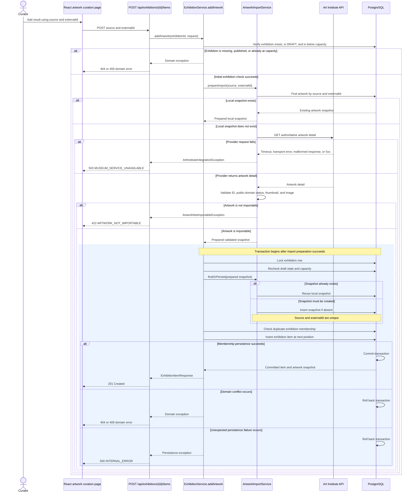

# Artwork import sequence

Import preparation happens before the membership transaction, allowing the authoritative provider
detail to be retrieved and validated without holding the exhibition lock. Provider outages terminate
with `503 MUSEUM_SERVICE_UNAVAILABLE`. A missing, mismatched, non-public-domain, or otherwise unusable
artwork terminates with `422 ARTWORK_NOT_IMPORTABLE`.

Only a successfully prepared import enters the transaction. The transaction locks and rechecks the
exhibition, reuses or persists the local artwork snapshot, and creates the ordered exhibition
membership. A successful transaction commits and returns `201 Created`. Domain conflicts or
persistence failures roll back, so neither the exhibition item nor a newly inserted artwork snapshot
is committed by a failed import.