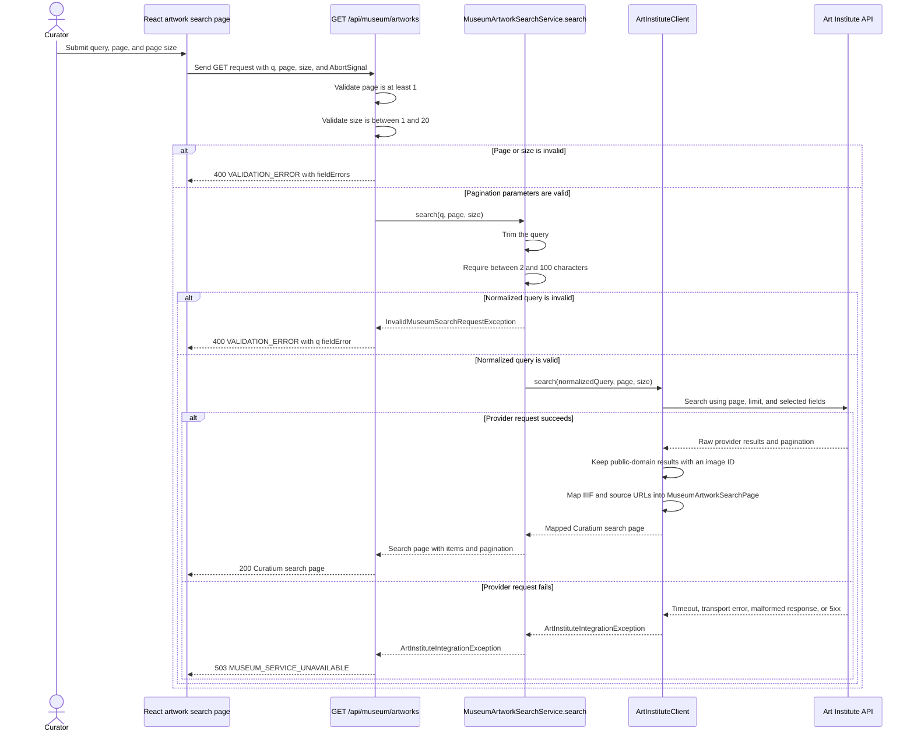

# Artwork search sequence

The frontend never calls the museum provider directly. The controller validates pagination before
calling `MuseumArtworkSearchService`, which normalizes and validates the query before delegating.
`ArtInstituteClient` owns the provider request, applies its configured timeouts, filters unusable
results, maps IIIF and source URLs, and returns the `MuseumArtworkSearchPage`.

Curatium exposes only the reliable pagination fields: `page`, `pageSize`, and `hasNextPage`.

Cancellation is shown at the frontend request boundary rather than as a guaranteed cancellation of
the provider request. When the browser request is aborted, the page ignores the result. The backend
provider call remains governed by the configured HTTP client timeouts.
