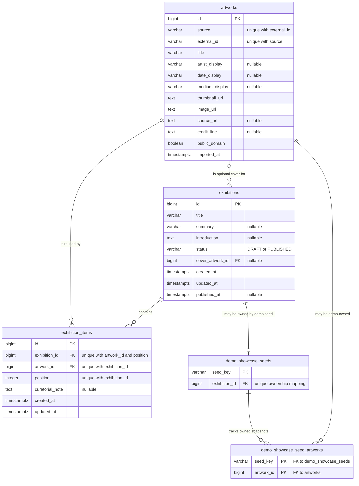

# Entity relationship diagram

`artworks` is a locally persisted provider snapshot, while `exhibition_items` supplies the ordered
many-to-many membership. `cover_artwork_id`, summary, introduction, notes, and `published_at` are
nullable as shown; item position is unique within an exhibition, and source plus external ID is
unique for an artwork. The demo ownership tables were introduced by V6 and track only the opt-in
showcase, not normal curator data.

The diagram omits database check constraints such as public-domain-only artwork snapshots and
positive item positions from the field list, but retains the relationships and uniqueness rules
that shape application behavior.
