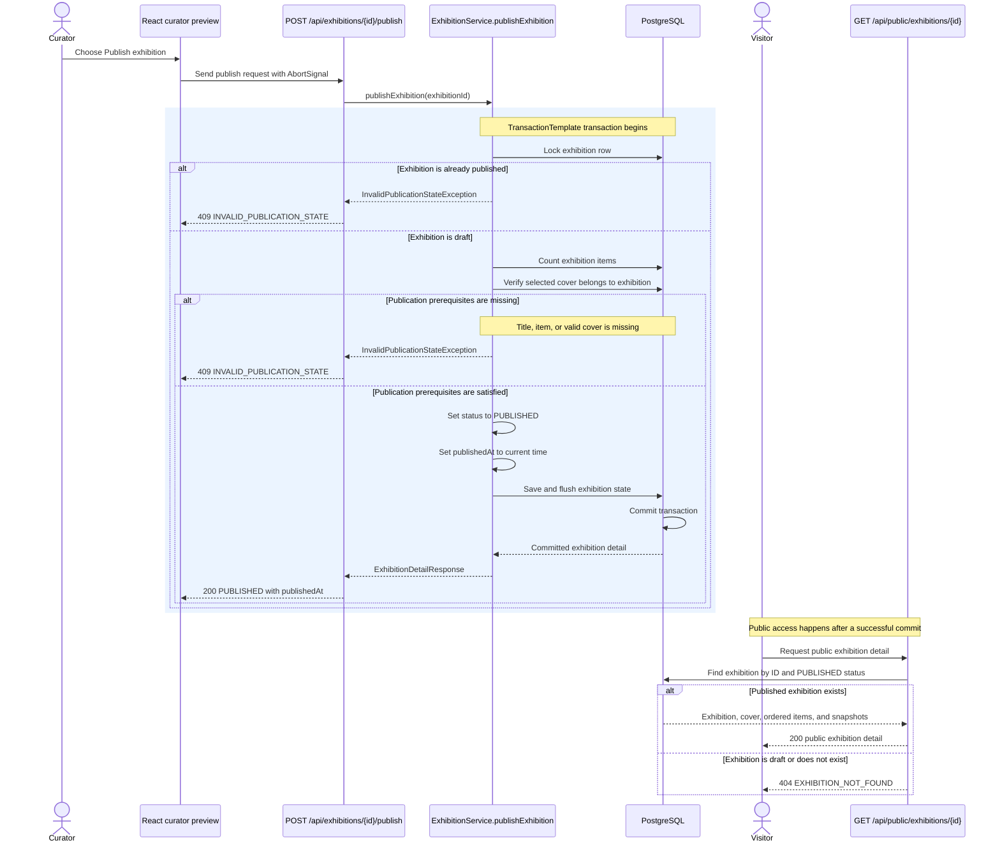

# Publication sequence

Publication is an atomic state transition. For a draft exhibition, the backend requires a title,
at least one exhibition item, and a cover that is also an exhibition item. It then persists
`status = PUBLISHED` together with the current `publishedAt` value.

Item ordering is maintained by the persisted exhibition item model. Publication counts the items
but does not perform a separate ordering validation.

The frontend replaces its preview state only with the committed response. After publication, the
exhibition is treated as read-only in the curator interface until a separate unpublish transition
succeeds.

Public availability is intentionally shown as a later read rather than as a notification. The
system does not publish an event or push an update to visitors. Public endpoints simply return
exhibitions whose committed status is `PUBLISHED`.